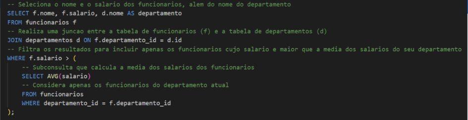
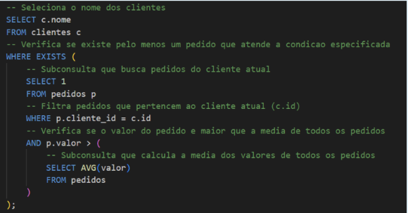

# README sobre os seminários apresentados

# Funções de Agregação com GROUP BY
&nbsp; Funções de agregação são
ferramentas em bancos de
dados que resumem e
calculam informações de
conjuntos de dados,
operando em grupos de
linhas e retornando um
único valor, facilitando
análises estatísticas.

## Funções

1. ***COUNT()***: Conta o número
total de linhas em um
conjunto de dados.

2. ***SUM(coluna)***: Calcula a soma de todos os valores em uma coluna  numérica, sendo comumente usada para obter o total de vendas, despesas ou outros valores somáveis.

3. ***AVG(coluna)***: Calcula a média dos valores em uma coluna numérica.

4. ***MIN(coluna)***: Identifica o menor valor presente em uma coluna.

5. ***MAX(coluna)***: Identifica o maior valor em uma coluna.
 

# Joins em SQL
&nbsp;  Joins são operações que combinam dados de duas ou mais tabelas com base em uma condição comum, geralmente envolvendo chaves primárias e chaves estrangeiras. Eles permitem que você consulte dados relacionados que estão distribuídos em diferentes tabelas.

## Funções
1. ***INNER JOIN***: O INNER JOIN usa uma condição para determinar como os registros devem ser combinados. Normalmente, isso envolve comparações entre colunas de diferentes
tabelas.

2. ***LEFT JOIN***: Um LEFT JOIN (ou LEFT OUTER JOIN) é utilizado em SQL para retornar todos os registros da tabela à esquerda e os registros
correspondentes da tabela à direita. Se não houver correspondência, os resultados da tabela à direita aparecerão como NULL.

3. ***RIGHT JOIN***: Em SQL, o RIGHT JOIN (ou RIGHT OUTER JOIN ) é usado para combinar filas de tabelas, mostrando todas as filas da tabela da direita e as filas coincidentes da tabela da esquerda. Se não houver coincidências, serão exibidos valores nulos para as colunas da tabela de exclusão.

4. ***FULL OUTER JOIN***: Um FULL OUTER JOIN combina os resultados de um LEFT JOIN e um RIGHT JOIN, retornando todos os registros de ambas as
tabelas. Quando não há correspondência, os resultados de uma tabela aparecem como NULL.
 

# Operadores Lógicos
&nbsp; Os operadores são umas ferramentas usadas como manipulação para consulta de dados, essas ferramentas permitem execução operadores complexos na busca de dados, filtragem, definir condições e entre outros.

## Funções

1. ***AND***: Combina duas ou mais condições, retornando verdadeiro apenas se todas as condições forem verdadeiras.

2. ***OR***: O operador OR é utilizado para unir duas ou mais condições numa consulta, onde pelo menos uma das condições deve ser verdadeira para que o registro seja incluído no resultado.

3. ***NOT***: Inverte o valor de verdade de uma condição. Retorna verdadeiro se a condição for falsa.

4. ***IN***: O operador IN é utilizado para verificar se um valor está
presente em uma lista de valores especificados. É uma
maneira concisa de fazer múltiplas comparações.

5. ***NOT IN***: O operador NOT IN faz o oposto do IN, ou seja, verifica se um valor não está presente na lista de valores especificados.

6. ***BETWEEN***: O operador BETWEEN é usado para filtrar resultados dentro de um intervalo específico. Pode ser usado com números, datas ou outros tipos de dados. O intervalo é inclusivo.

7. ***LIKE***: O operador LIKE é usado em uma cláusula WHERE para buscar um padrão dentro de uma coluna de texto. Ele é especialmente útil quando você não conhece o valor exato, mas quer fazer buscas baseadas em padrões ou parte de palavras.

8. ***IS NULL***: O operador IS NULL é usado para verificar se um valor em uma coluna é nulo (ou seja, que o valor não foi inserido ou é desconhecido).
 

# Subconsultas
&nbsp; Subconsultas são consultas SQL dentro de outra consulta principal, com o objetivo de permitir a recuperação de dados mais específica, filtrada ou agregada.

## Exemplos

 

# Operadores de Agregação
&nbsp; As funções agregadas são ferramentas poderosas para resumir e analisar dados. Elas permitem que você obtenha insights valiosos sobre seus dados, agrupando informações e realizando cálculos.

## Funções

1. ***SUM***: A função SUM é utilizada para calcular a soma de valores numéricos em um conjunto de dados. Ela é ideal para obter totais de vendas, lucros quantidades, entre outros.

2. ***AVG***: A função AVG calcula a média aritmética de um conjunto de valores. É útil para analisar indicadores como média de vendas por
mês, média de idade de clientes, etc. A função AVG divide a soma de todos os valores pelo número
total de valores.

3. ***COUNT***: A função COUNT é utilizada para contar o número de registros em um conjunto de dados. É útil para obter contagens de clientes,
produtos, transações, etc.

## Diferença entre SUM, AVG e COUNT

* Cada função agregada serve a um propósito específico: SUM calcula a soma, AVG calcula a média e COUNT conta os registros. Compreender suas diferenças é crucial para utilizar as funções corretamente.

Função | Objetivo
-------|---------
SUM    | Calcular a soma de valores    
AVG    | Calcular a média de valores      
COUNT  | Contar o número de registros

## MIN e MAX: Identificação de valores extremos em conjuntos de dados
&nbsp; As funções MIN e MAX permitem encontrar os valores mínimo e máximo
em um conjunto de dados. Elas são úteis para identificar outliers, pontos
extremos e limites de dados.
 

# Indexação e Perfomace
&nbsp; Um índice é uma estrutura auxiliar de dados que
melhora a velocidade de recuperação de registros em
uma tabela, proporcionando uma busca mais
eficiente. Importância em sistemas com grandes volumes de dados, a indexação pode reduzir significativamente o tempo de resposta das consultas. Impacto da indexação pode ser ainda maior em aplicações de alta carga, como sistemas de e- commerce, redes sociais e bancos de dados financeiros.

## Tipos de índices 

* ***Índices Únicos***: Usados para garantir que os dados sejam únicos,
como em chaves primárias.

* ***Índices Compostos***: Útil em consultas que filtram por mais de uma
coluna. Exemplo: Se você filtra por data e status, um índice
composto pode otimizar essa consulta.

* ***Índices Bitmap***: Ideal para colunas com poucos valores distintos,
como status de um pedido (ativo/inativo), mas evite para colunas
que mudam frequentemente.

* ***Índices Full-Text***: Essenciais em buscas que envolvem grandes
volumes de texto, como buscas por palavras-chave em artigos ou
produtos.
 

# Importância das Transações
## *Funcionamento de uma Transação em Banco de Dados*
&nbsp; Uma transação em um banco de dados é um conjunto de operações que são executadas como uma única unidade de trabalho. Para garantir a integridade e a consistência dos dados, as transações devem seguir os princípios do modelo ACID: Atomicidade, Consistência, Isolamento e Durabilidade.

## Início da Transação
&nbsp; A transação é iniciada com um comando
específico, que pode variar conforme o
sistema de gerenciamento de banco de
dados (SGBD). Normalmente, isso envolve
uma instrução que sinaliza o início da
transação.
Por exemplo: código START
TRANSACTION;

## COMIT
&nbsp; Se todas as operações forem executadas com sucesso e sem erros. A transação pode ser finalizada com um comando COMMIT. Isso torna todas as alterações permanentes e visíveis para outras transações. Após o COMMIT, não é mais possível reverter as mudanças feitas na transação.

## Durabilidade
&nbsp; Uma vez que uma transação foi confirmada com um COMMIT, suas alterações são garantidas para persistir, mesmo em caso de falhas no sistema. O banco de dados registra essas mudanças de forma que possam ser recuperadas posteriormente. Isso significa que, após um COMMIT, mesmo que o sistema caia, as alterações estarão disponíveis na próxima vez que o banco de dados for acessado.